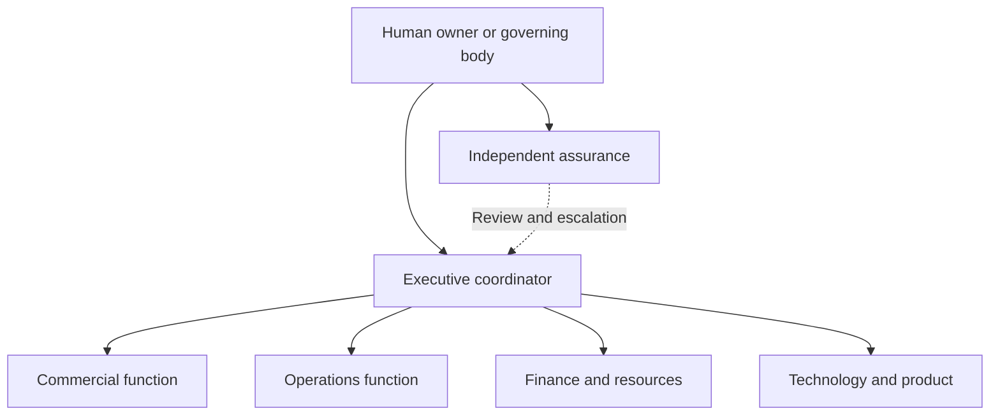

# ELAEF Agent Organization

An agent organization assigns responsibility, decision rights, work, review, and escalation. Its purpose is to achieve the owner's intended outcomes with classified knowledge, evidence-backed decisions, authorized tasks, measurable outputs, and durable records.

Start with one coordinator and add roles only for an actual workload or necessary independent review. A role is a responsibility; an agent instance is a configured implementation of that role. A person, one agent, or several agents may perform a role. Record who performs it now. A separate prompt does not by itself establish independent review.

## Organization and accountability

The following is a company-scale reference organization, not a required staffing plan or an activated team.

| Role | Owns | Typical outputs | Boundary |
|---|---|---|---|
| Human owner / governing body | Purpose, policy, appointment, reserved decisions and accountability | Approved direction, delegation and material commitments | Can withdraw delegation; existing non-waivable constraints remain |
| Executive coordinator | Priorities, dependencies, allocation within its mandate, owner interaction | Current plan, task assignments, reconciled state, exception report | Cannot extend its own authority or override independent findings silently |
| Functional lead | A defined operational function and its performance | Accepted deliverables, recurring process results, resource requests | Acts within a recorded delegation and shared resource allocation |
| Specialist / task executor | One bounded assigned task | Output, sources, execution attempts, completion evidence | Does not infer authority from assignment or available tools |
| Assurance reviewer | Independent challenge of specified decisions, controls or outputs | Findings, acceptance/rejection recommendation, escalation | Approval power exists only when expressly delegated; cannot approve its own execution where independence is required |
| Record custodian | Reconciliation and integrity of assigned authoritative records | Validated state update, provenance, continuity | One active writer per record; role can be combined where consequence permits |

Researchers, analysts, planners, experiment designers and validators remain useful specialist roles. Departments are optional. Organizational responsibility does not require an additional management agent at every level.

## Role contract and agent register

Use the starter's `60_templates/09_agent_role.md` when a separate record is useful. Every material role identifies purpose, accountable party, decisions permitted and reserved, inputs, outputs, review method, measures, escalation, substitute, and authority reference.

Maintain an agent register mapping role ID to instance ID, platform, model/version, workspace, credentials reference, tools, data access, deployment state, and owner. Keep secrets in their controlled store. This deployment map is distinct from the organization chart: replacing a model does not transfer or enlarge responsibility.

An instance progresses through **proposed → configured → tested → active → suspended → retired**. Configuration and tests alone cannot activate it. Activation records actual authority, demonstrated capability, limits, recovery, and the intended operational scope. Suspend dependent jobs and revoke relevant access when authority is withdrawn; changing a Markdown status alone is insufficient enforcement.

## Delegation and decision rights

Record delegator, delegate, exact scope, permitted operations and targets, read/write/external-action/approval rights, resource allocation, exclusions, applicable gates, start and expiry, review trigger, subdelegation permission, and authorization evidence. Use `60_templates/10_delegation.md` for a separate record.

Authority is valid only while its full chain remains valid. A child delegation must fit every ancestor's permitted operations, targets, time, resources and exclusions. An agent may not grant itself new rights, approve its own delegation, or use a new session, substitute model, subagent, or retry to reset a shared limit. Parallel allocations and actual use must fit the same parent budget. Return unused allocation explicitly; do not assume that suspension refunds it.

Routine decisions inside a valid envelope can proceed without asking again. Escalate only a material missing choice, exceeded boundary, unresolved conflict, or reserved decision. A pending decision blocks its dependent work; independent authorized preparation continues.

The offline checker supports a deliberately narrow flat delegation vocabulary: exact string allowlists in `allowed_operations` and `allowed_targets`, a decimal `budget_limit` with `budget_unit`, `valid_from`, `expires_on`, `parent_delegation`, and `subdelegation: allowed|forbidden`. No wildcards or semantic interpretation of prose are supported. Runtime budgets, approval identity, resource consumption and enforcement require separate verification.

## Work assignment and coordination

1. The coordinator reads current purpose, state, evidence, authority and capacity.
2. It selects a ready **Task** and identifies its executor, input version, output, reviewer, time/cost limit, stopping condition and write owner.
3. Independent specialists may work in parallel on separate outputs. Bound delegation depth, concurrent work and retries before execution.
4. The reviewer checks the actual output in proportion to consequence. Preserve competing findings and unresolved uncertainty.
5. The designated writer re-reads the authoritative record, reconciles accepted results, validates the update and records provenance.
6. The coordinator reports useful progress, material exceptions and the next justified move.

Evidence produced by agents using the same source or method is not automatically independent corroboration. For consequential decisions, specify the required separate method, reviewer or human assessment.

## Capacity, performance and replacement

Allocate attention across existing commitments before starting new initiatives. Record available capacity, work in progress, expected benefit, dependencies and opportunity cost. Deferral or no new work can be the best decision.

Review output quality, correction/rework, completion time, actual operating cost, avoidable approval questions and successful resumption. Define units and baselines before comparing agents; do not invent improvement percentages or optimize for number of tasks completed. Replace or simplify a role when evidence shows that its coordination cost exceeds its contribution.

Changes to prompts, tools, models, role contracts or permissions are proposed, assessed, tested and versioned. Agents may prepare improvements within authority, but must not silently alter their own approval requirements. See [assurance](08_validation_and_assurance.md) and [runtime integration](07_runtime_integration.md).
