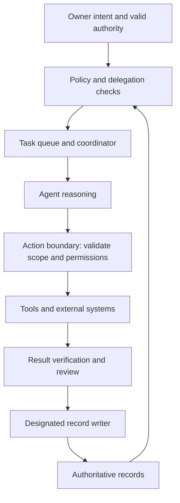

# ELAEF Runtime Integration

ELAEF defines what must be governed. A runtime executes agents and workflows. A platform profile maps those requirements to a particular version and configuration, and records the controls that still require implementation. A written role or prompt does not prove a technical boundary.

## Architecture

The runtime must check effective authority at the action boundary, including expiry/revocation and shared resource use. Agent reasoning may propose an action; deterministic checks and configured access controls enforce supported limits. Anything not enforceable must be disclosed and handled by a bounded manual procedure or kept unavailable.

## Mandatory profile map

| Requirement | Profile must identify | Acceptance evidence |
|---|---|---|
| Identity and roles | Stable role/instance mapping, owner, versions | Configuration inspected; actual actor attribution demonstrated |
| Delegation and permissions | Effective allowlists, parent restrictions, approval route | Permitted action succeeds; forbidden and revoked action is denied |
| Workspace and data | Filesystem boundary, secrets reference, connector scope | Out-of-scope read/write and credential exposure checks |
| Resource limits | Shared budget, concurrency, depth, retry and duration controls | Limit remains effective across child runs and restarts |
| Tasks and recurrence | Queue, run IDs, deduplication, scheduling and cancellation | Duplicate/overlapping run and missed occurrence tests |
| State and writes | Durable store, locking/revision checks, designated writer | Conflict preserves both contributions; interrupted write recovers |
| Approval | Exact action/scope, approver, expiry and replay behavior | Mismatched/expired approval rejected; valid approval reused only in scope |
| Recovery and review | Result verification, incident controls, rollback and audit export | Uncertain external outcome reconciled before retry; pause reaches workers |

Every row states **native**, **additional component**, **manual control**, or **unsupported**, with configuration references, test evidence and known limitations. No universal cross-platform equivalence is assumed. Unknown controls cannot be marked enforced.

## Implementation states

**documented → configured → tested → active → suspended → retired**

- Documented: architecture and acceptance tests exist; no installation claim.
- Configured: exact versions, configuration fingerprint and environment recorded; no behavior claim.
- Tested: bounded test evidence exists for the declared capability set; no operational authority implied.
- Active: an authorized decision permits a specific operating scope after reviewing test results and remaining gaps.
- Suspended/retired: cessation and access/job changes are verified, with residual obligations recorded.

Use `60_templates/11_runtime_deployment.md` in the core starter. Record the platform version, profile revision, environment, configuration fingerprint, control map, test evidence, decision and actual activation state. Model/provider/tool changes may invalidate prior evidence and require targeted retesting.

## Available profiles

See [profile index](12_runtime_profiles/00_profiles_index.md). OpenClaw and LangGraph are documented candidates; the manual agent profile explains file-based use. None is claimed installed, integrated, tested or active by this release. This overhaul adds the implementation contract and test plan, not a hosted service or background company.

## First integration pilot

Use a temporary workspace and synthetic records with no external accounts. Pin the selected versions, configure a coordinator/executor/reviewer as needed, and run one task that produces and validates a local artifact. Test revocation, parent limits, unavailable tools, conflicting writes, restart and duplicate-run recovery. Save actual logs and artifacts; distinguish simulated external effects from real tool enforcement. Resolve every required control gap before requesting activation of a concrete operational scope.

The offline CLI checks declared record structure. It does not install a runtime, enforce permissions, authenticate approvals, meter use, schedule work or control running processes. See [assurance](08_validation_and_assurance.md).

## Agent system and owner interface

Use the [AI agent system and owner dashboard](09_ai_agent_system_and_dashboard.md) for state-triggered preparation, approval/changes workflow, source freshness, revision-bound decisions and technical/owner separation. Implement and test the selected controls before claiming operational capability.
