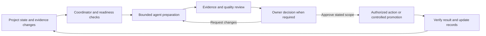

# AI agent system and owner dashboard

An operational implementation connects the [agent organization](05_agent_organization.md), current project records, work queue, runtime, review controls and owner dashboard. The coordinator identifies useful work within the owner's mandate; the owner directs outcomes and handles decisions reserved to them. Routine task authoring is not a prerequisite for useful preparation.

This is a reusable implementation contract. A project must configure and test its own system; the framework does not supply a running dashboard or connected model.

## Agent-led operating loop

A permitted trigger can be a material source change, due obligation, dependency becoming ready, review date or owner feedback. Declare the monitored sources, cadence, limits and stop conditions. Deduplicate repeated scans/restarts using the exact source/configuration baseline and logical work identity. A rejected proposal is not silently resubmitted; reopening needs a recorded reason or changed basis. Missing sources produce a visible hold, never a successful empty scan.

Preparation, model generation, quality review, owner decision, canonical record promotion and external execution are separate steps. Standing authority permits routine work within scope; only decisions requiring the owner enter their approval queue. An internal artifact approval does not automatically pass a business gate or authorize external action.

## Owner dashboard

| View | Required information |
|---|---|
| Overview | Purpose, outcomes, accepted progress, gates, current checkpoint and actual system status |
| For approval | Decision-ready proposals with exact output, recommendation, alternatives, evidence, risks, requested authority and bounded next action |
| Agent work | Responsible role, queued/running/reviewing work, dependencies, limits and actual blockers |
| Needs attention | Stale sources, missing inputs, failed checks, expiry, exhausted limits, paused work and incidents |
| Decision history | Approvals, rejections and requested changes tied to the exact reviewed proposal and actor |

Provide **Approve**, **Reject** and **Request changes** where applicable. Requested changes require useful feedback, preserved with the prior candidate and carried into the next preparation. A revision invalidates its earlier check and decision readiness. Preserve real empty states; never populate live views with fictional progress or decisions.

A decision card identifies the proposal revision/fingerprint, source baseline, quality-check revision, approver, time, scope and expiry. The server rechecks these conditions when accepting a decision; disabling a button alone is insufficient. Changed sources, expired authority, failed/missing review or a pause hold the affected approval. Re-read current authoritative sources before promotion; a fresh snapshot timestamp does not prove the originals are unchanged.

Keep owner decisions separate from technical controls for model connection, diagnostics, configuration and manual response import. Use clear status labels, readable responsive layouts and accessible controls. Display the project's actual identity without making visual polish a measure of readiness.

## Technical reference architecture

Use selected read-only source snapshots, a durable work/event store, coordinator, replaceable model/runtime adapter, review service, owner interface and designated canonical writer. The dashboard derives business progress from authoritative records and shows their cutoff/freshness. Dashboard reads must not create work or alter project state.

OpenClaw or another runtime may implement orchestration. Business authority, version-bound review, approval persistence and promotion may require additional components; map each responsibility through the [runtime integration contract](07_runtime_integration.md). Do not imply a platform provides them automatically.

For a local pilot, isolate workers and permissions, restrict entry access, keep credentials in a controlled store and live transactional state outside synchronizing document folders. Record source/configuration fingerprints; commit events with state changes and verify backup/restore. A browser closed overnight does not stop a configured worker; provide a verified pause/stop path. Remote or multi-user rollout additionally requires appropriate authentication, access control, transport protection and tested recovery.

Show infrastructure health, model connection, proven agent behavior and authorized operating scope separately. A healthy gateway, configured roles or automatic queue intake cannot establish active AI generation. Local tests do not establish server readiness.

## Acceptance before operational use

Demonstrate: repeated triggers/restarts create no duplicate work; stale or changed proposals cannot be approved; feedback survives revision; rejected baselines stay closed; missing/model-disconnected states remain honest; viewing the dashboard causes no writes; pause and recovery preserve evidence; promotion cannot exceed approved scope. Collect actual results using the [assurance guide](08_validation_and_assurance.md).

Use the starter's dashboard contract template only when implementing this optional interface. A small project may continue with its ordinary hub and conversation.
